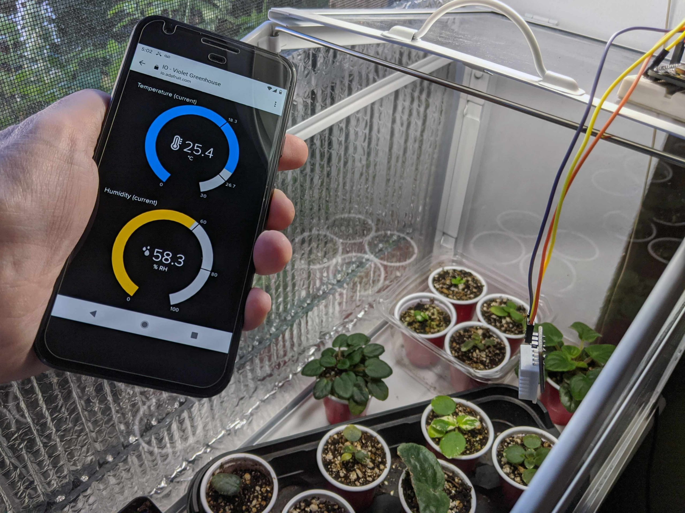
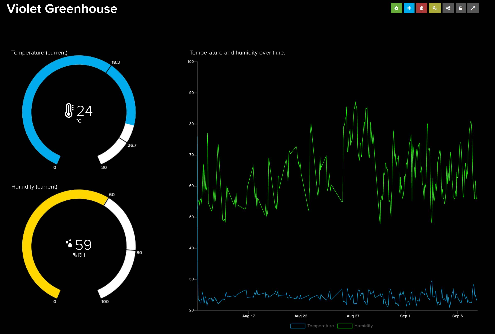
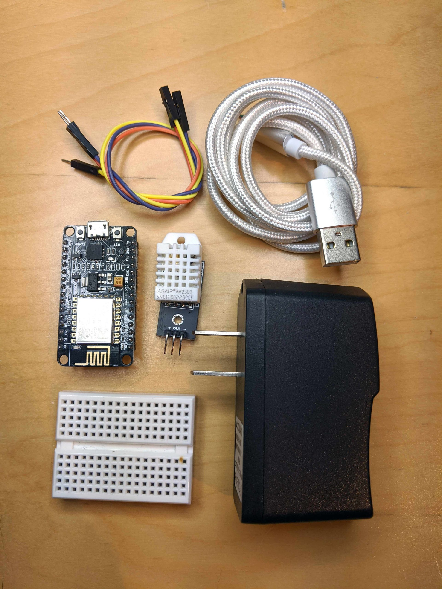
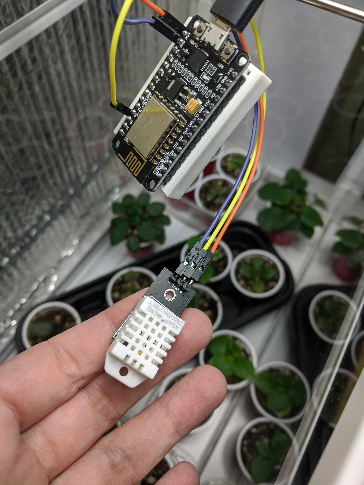
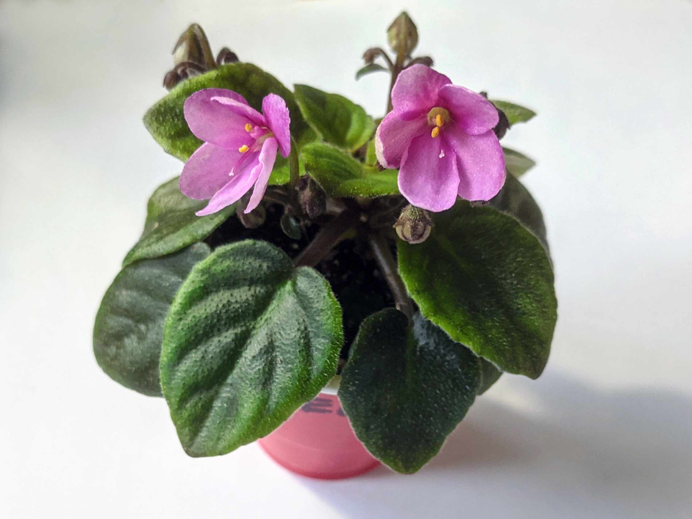

# IoT Greenhouse Monitor

After killing many African Violets in my mini greenhouse, something had to change. I built an Internet of Things (IoT) monitoring system to track temperature and humidity, visualize it on a web dashboard, and send alerts when conditions aren't optimal.


*Greenhouse with African Violets, monitoring hardware, and live dashboard*


*Dashboard screenshot showing data patterns over time*

## Features

- Real-time temperature and humidity monitoring
- Web-based dashboard with customizable visualizations
- Email alerts when conditions are outside safe ranges
- 30-day data history for pattern analysis
- Low cost (~$25 in parts)
- Easy setup with minimal coding required

## Table of Contents

- [How It Works](#how-it-works)
- [Parts Required](#parts-required)
- [Prerequisites](#prerequisites)
- [Installation](#installation)
- [Configuration](#configuration)
- [Usage](#usage)
- [Troubleshooting](#troubleshooting)
- [Future Improvements](#future-improvements)

## How It Works

### 1. The Hardware
The DHT-22 sensor is a combined temperature and humidity sensor with an impressive range (-40°C to 80°C, 0-100% RH). The sensor connects to a NodeMCU ESP8266 dev board that runs Arduino C code and can be easily programmed via USB using the [Arduino IDE](https://www.arduino.cc/en/software).

### 2. The Code
The Arduino sketch instructs the hardware to:
1. Take a reading from the DHT-22 sensor
2. Print the result to the serial port for debugging
3. Send data over WiFi to [Adafruit.io](https://io.adafruit.com)
4. Wait briefly, then repeat

### 3. Data and Alerting
[Adafruit.io](https://io.adafruit.com) stores data and provides a customizable dashboard. The free tier includes:
- 30 days of data storage
- Rate limit of 10 samples per minute
- Data feeds that can trigger alerts

Adafruit.io connects to [IFTTT.com](https://ifttt.com) for alerting. I use email notifications, but SMS, push notifications, and other options are available.

## Parts Required


*All components needed for the greenhouse monitoring system (laptop not shown)*

**Total cost: ~$25**

1. NodeMCU ESP8266 12E dev board (narrow version to fit breadboard)
2. DHT-22 temperature and humidity sensor
3. Micro-USB cable
4. Breadboard and jumper wires
5. Laptop for programming
6. Optional: 5V USB power supply (for standalone operation)

## Prerequisites

- Basic understanding of Arduino (or willingness to learn—[getting started guide](https://docs.arduino.cc/learn/starting-guide/getting-started-arduino/))
- Computer with USB port
- 2.4GHz WiFi network (5GHz not supported by ESP8266)
- Free accounts at:
  - [Adafruit.io](https://io.adafruit.com)
  - [IFTTT.com](https://ifttt.com)

## Installation

### Step 1: Set Up Third-Party Services

1. Create an account at [Adafruit.io](https://io.adafruit.com) and generate a secret key
2. Create two feeds: `temperature` and `humidity`
3. Create an account at [IFTTT.com](https://ifttt.com)

### Step 2: Assemble the Hardware

1. Mount the NodeMCU on the breadboard.
2. Connect the DHT-22 sensor:
   - **VCC** → 3.3V
   - **GND** → Ground
   - **DATA** → Pin D2


*NodeMCU and DHT-22 sensor connected on breadboard*

### Step 3: Install Arduino IDE and Libraries

1. Download and install the [Arduino IDE](https://www.arduino.cc/en/software)
2. Add ESP8266 board support (File → Preferences → Additional Board URLs)
3. Install required libraries (Sketch → Include Library → Manage Libraries):
   - DHT sensor library by Adafruit
   - Adafruit Unified Sensor by Adafruit
   - Adafruit IO Arduino by Adafruit

### Step 4: Upload the Code

1. Download this repo and open it in the Arduino IDE
2. Update the configuration (see [Configuration](#configuration) below)
3. Select the board: Tools → Board → NodeMCU 1.0 (ESP-12E Module)
4. Select the correct port: Tools → Port
5. Click Upload

## Configuration

Edit these lines in config.h:

```cpp
// Adafruit.io credentials
#define IO_USERNAME "your_adafruit_username"
#define IO_KEY "your_adafruit_secret_key"

// WiFi credentials (must be 2.4GHz network)
#define WIFI_SSID "your_network_name"
#define WIFI_PASS "your_network_password"
```

## Usage

### Testing the Setup

Open Serial Monitor (Tools → Serial Monitor) at 115200 baud to verify temperature and humidity readings appear. Breathe on the sensor to confirm values change, then check your Adafruit.io dashboard for incoming data. Create a new dashboard and add each data field as a guage.

### Setting Up Alerts

1. Log in to [Adafruit.io](https://io.adafruit.com)
2. Go to Services and connect to IFTTT
3. Visit [IFTTT.com/create](https://ifttt.com/create)
4. Configure your alert:
   - **If This:** Choose Adafruit and set your threshold (e.g., temperature > 30°C)
   - **Then That:** Choose your notification method (email, SMS, etc.)

### Running Standalone

Once everything is working, disconnect from your computer and plug the NodeMCU into any 5V USB power supply. It will automatically connect to WiFi and start sending data.

## Troubleshooting

| Problem | Solution |
|---------|----------|
| Serial Monitor shows "nan" | Check sensor wiring, ensure connections are secure |
| Can't connect to WiFi | Verify you're using 2.4GHz network, check credentials |
| No data on Adafruit.io | Verify IO_USERNAME and IO_KEY are correct, check feed names |
| Sensor readings seem off | DHT-22 needs 2-second intervals between readings (already in code) |
| Upload fails | Check correct board and port are selected, try different USB cable |

## Future Improvements

Future iterations could include a custom enclosure, integrated fan control, and a soil moisture sensor with automatic watering.

## Acknowledgments

- Built with [Adafruit.io](https://io.adafruit.com)
- Inspired by the need to keep African Violets happy


*African violet, Allegro Once In a While*

---
